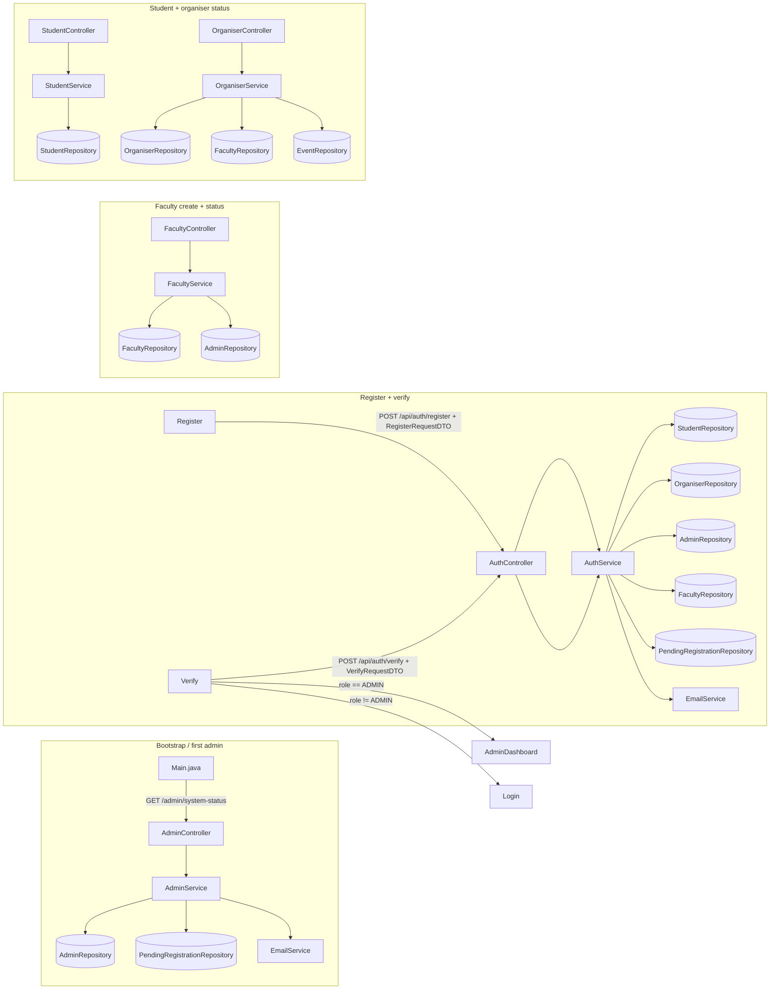
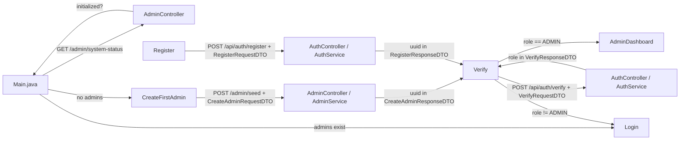

# Campus Events

Campus Events is a Spring Boot backend with a Swing frontend for student, organiser, faculty, and admin workflows.

## What this project does

- Bootstrap a first admin when the database is empty
- Support OTP verification for account creation
- Load faculties from the backend into the registration UI
- Open the admin dashboard only after an admin account is verified
- Keep the backend domain models immutable with copy-based status updates

## How to run

### Backend

From `backend/`:

```powershell
.\mvnw.cmd spring-boot:run
```

Useful checks:

```powershell
.\mvnw.cmd -q -DskipTests compile
.\mvnw.cmd test
```

### Swing frontend

From `swing-frontend/swing-frontend/`:

```powershell
.\mvnw.cmd exec:java
```

## Startup flow

1. The Swing app calls `GET /admin/system-status`.
2. If the backend has no admins yet, it opens the first-admin setup screen.
3. If admins already exist, it opens the normal login screen.
4. First-time admin setup sends `CreateAdminRequestDTO` to `POST /admin/seed`.
5. The backend creates a pending registration, emails an OTP, and returns `CreateAdminResponseDTO` with a UUID.
6. The OTP screen posts `VerifyRequestDTO` to `POST /api/auth/verify`.
7. The backend returns `VerifyResponseDTO` containing the verified role.
8. The admin dashboard opens only when that verified role is `ADMIN`.

## UML

### Backend domain and service model

```mermaid
classDiagram
    class Admin {
        -Long id
        -String firstName
        -String lastName
        -String email
        -Date createdAt
        -String password
        +getId() Long
        +getFirstName() String
        +getLastName() String
        +getEmail() String
        +getCreatedAt() Date
        +getPassword() String
        +withPassword(password) Admin
    }

    class Faculty {
        -Long id
        -String name
        -String contactEmail
        -boolean active
        -LocalDateTime createdAt
        +getId() Long
        +getName() String
        +getContactEmail() String
        +isActive() boolean
        +getCreatedByAdmin() Admin
        +getCreatedAt() LocalDateTime
        +new Faculty(existing, active) Faculty
    }

    class Student {
        -Long id
        -String firstName
        -String lastName
        -String email
        -String studentNumber
        -String password
        -boolean isVerified
        -boolean active
        +getId() Long
        +getFirstName() String
        +getLastName() String
        +getEmail() String
        +getStudentNumber() String
        +isVerified() boolean
        +isActive() boolean
        +getFaculty() Faculty
        +getPassword() String
        +new Student(existing, active) Student
    }

    class Organiser {
        -Long id
        -String firstName
        -String lastName
        -String email
        -String role
        -LocalDateTime createdAt
        -boolean active
        -String password
        +getId() Long
        +getFirstName() String
        +getLastName() String
        +getEmail() String
        +getRole() String
        +getCreatedAt() LocalDateTime
        +getFaculty() Faculty
        +isActive() boolean
        +getPassword() String
        +new Organiser(existing, active) Organiser
    }

    class Event {
        -Long id
        -String title
        -String description
        -LocalDateTime eventDate
        -Integer capacity
        -Boolean open
        -LocalDateTime createdAt
        +getId() Long
        +getTitle() String
        +getDescription() String
        +getEventDate() LocalDateTime
        +getCapacity() Integer
        +isOpen() boolean
        +getVenue() Venue
        +getOrganiser() Organiser
        +getFaculty() Faculty
        +isFull() boolean
        +closeRegistration() void
        +reopenRegistration() void
    }

    class Venue {
        -Long id
        -String name
        -Integer capacity
        +getId() Long
        +getName() String
        +getCapacity() Integer
        +getAddress() Address
    }

    class Address {
        <<Embeddable>>
        -String street
        -String suburb
        -String city
        -String postalCode
        -String province
        +getStreet() String
        +getSuburb() String
        +getCity() String
        +getPostalCode() String
        +getProvince() String
    }

    class Ticket {
        -Long id
        -Double price
        -String status
        -LocalDateTime createdAt
        +getId() Long
        +getPrice() Double
        +getStatus() String
        +getStudent() Student
        +getEvent() Event
        +getPromoCode() PromoCode
        +cancel() void
        +checkIn() void
        +isActive() boolean
    }

    class PromoCode {
        -Long id
        -String code
        -String discountType
        -Double value
        -String scopeType
        -Integer maxRedemptions
        -Integer timesUsed
        -LocalDateTime startDate
        -LocalDateTime expiryDate
        -Boolean active
        +getId() Long
        +getCode() String
        +getDiscountType() String
        +getValue() Double
        +getScopeType() String
        +getEvent() Event
        +getFaculty() Faculty
        +isActive() boolean
        +isValidNow() boolean
        +applyTo(ticket) void
    }

    class Notification {
        -Long id
        -String title
        -String message
        -Boolean read
        -LocalDateTime createdAt
        +getId() Long
        +getTitle() String
        +getMessage() String
        +isRead() boolean
        +getStudent() Student
        +markAsRead() void
    }

    class PendingRegistration {
        -String uuid
        -String firstName
        -String lastName
        -String email
        -String password
        -String role
        -Long facultyId
        -String studentNumber
        -String pin
        -LocalDateTime expiresAt
        -LocalDateTime createdAt
        +getUuid() String
        +getFirstName() String
        +getLastName() String
        +getEmail() String
        +getPassword() String
        +getRole() String
        +getFacultyId() Long
        +getStudentNumber() String
        +getPin() String
        +withPin(pin) PendingRegistration
        +withExpiresAt(expiresAt) PendingRegistration
    }

    class IAdminService {
        +seedAdmin(request) CreateAdminResponseDTO
        +isSystemInitialized() boolean
        +createAdmin(request, requestingAdminId) CreateAdminResponseDTO
        +changePassword(adminId, currentPassword, newPassword) void
        +authenticate(email, password) Optional~Admin~
    }
    class AdminService {
        +seedAdmin(request) CreateAdminResponseDTO
        +isSystemInitialized() boolean
        +createAdmin(request, requestingAdminId) CreateAdminResponseDTO
        +changePassword(adminId, currentPassword, newPassword) void
        +authenticate(email, password) Optional~Admin~
    }

    class IFacultyService {
        +save(faculty) Faculty
        +findById(id) Optional~Faculty~
        +findAll() List~Faculty~
        +deleteById(id) void
        +deactivate(facultyId) void
        +findByStatus(status) List~Faculty~
        +createFaculty(dto, adminId) Faculty
        +updateFacultyStatus(facultyId, active, adminId) void
    }
    class FacultyService {
        +save(faculty) Faculty
        +findById(id) Optional~Faculty~
        +findAll() List~Faculty~
        +deleteById(id) void
        +deactivate(facultyId) void
        +findByStatus(status) List~Faculty~
        +createFaculty(dto, adminId) Faculty
        +updateFacultyStatus(facultyId, active, adminId) void
    }

    class IStudentService {
        +updateStudentStatus(studentId, active, requestingAdminId) void
        +save(student) Student
    }
    class StudentService {
        +updateStudentStatus(studentId, active, requestingAdminId) void
        +save(student) Student
    }

    class IOrganiserService {
        +registerOrganiser(organiser, facultyId) Organiser
        +createEvent(organiserId, event) Event
        +updateEvent(organiserId, event) Event
        +closeEvent(organiserId, eventId) void
        +updateOrganiserStatus(organiserId, active, requestingAdminId) void
    }
    class OrganiserService {
        +registerOrganiser(organiser, facultyId) Organiser
        +createEvent(organiserId, event) Event
        +updateEvent(organiserId, event) Event
        +closeEvent(organiserId, eventId) void
        +updateOrganiserStatus(organiserId, active, requestingAdminId) void
    }

    class IEventService {
        +registerStudent(eventId) Event
        +cancelEvent(eventId) Event
    }
    class EventService {
        +registerStudent(eventId) Event
        +cancelEvent(eventId) Event
    }

    class ITicketService
    class TicketService
    class IPromoCodeService
    class PromoCodeService
    class IVenueService {
        +save(venue) Venue
        +findById(id) Optional~Venue~
        +findAll() List~Venue~
        +deleteById(id) void
        +findByName(name) List~Venue~
        +findByCapacityGreaterThan(capacity) List~Venue~
        +findByCity(city) List~Venue~
    }
    class VeneuService {
        +save(venue) Venue
        +findById(id) Optional~Venue~
        +findAll() List~Venue~
        +deleteById(id) void
        +findByName(name) List~Venue~
        +findByCapacityGreaterThan(capacity) List~Venue~
        +findByCity(city) List~Venue~
    }
    class AuthService {
        +register(request) RegisterResponseDTO
        +verify(request) VerifyResponseDTO
        +resend(request) RegisterResponseDTO
        +login(request) LoginResponseDTO
    }
    class EmailService {
        +sendVerificationEmail(email, pin) void
    }

    class AdminRepository
    class FacultyRepository
    class StudentRepository
    class OrganiserRepository
    class EventRepository
    class TicketRepository
    class PromoCodeRepository
    class VenueRepository
    class PendingRegistrationRepository

    IAdminService <|.. AdminService
    IFacultyService <|.. FacultyService
    IStudentService <|.. StudentService
    IOrganiserService <|.. OrganiserService
    IEventService <|.. EventService
    ITicketService <|.. TicketService
    IPromoCodeService <|.. PromoCodeService
    IVenueService <|.. VeneuService

    Admin "1" --> "*" Faculty : creates
    Faculty "1" --> "*" Student : faculty
    Faculty "1" --> "*" Organiser : faculty
    Faculty "1" --> "*" Event : faculty
    Faculty "1" --> "*" PromoCode : faculty
    Organiser "1" --> "*" Event : organiser
    Venue "1" --> "*" Event : venue
    Venue "1" *-- "1" Address : embeds
    Event "1" --> "*" Ticket : event
    Event "1" --> "*" PromoCode : event
    Student "1" --> "*" Ticket : student
    Student "1" --> "*" Notification : student
    PromoCode "1" --> "*" Ticket : promoCode

    AdminService ..> AdminRepository
    AdminService ..> PendingRegistrationRepository
    AdminService ..> EmailService

    AuthService ..> AdminRepository
    AuthService ..> FacultyRepository
    AuthService ..> StudentRepository
    AuthService ..> OrganiserRepository
    AuthService ..> PendingRegistrationRepository
    AuthService ..> EmailService

    FacultyService ..> FacultyRepository
    FacultyService ..> AdminRepository
    StudentService ..> StudentRepository
    OrganiserService ..> OrganiserRepository
    OrganiserService ..> FacultyRepository
    OrganiserService ..> EventRepository
    EventService ..> EventRepository
    TicketService ..> TicketRepository
    PromoCodeService ..> PromoCodeRepository
    VeneuService ..> VenueRepository
```



### Backend action flow



## Data flow



## Screenshot placeholders

Add the final UI screenshots here once they are ready.

### Bootstrap / first admin


### Login


### Registration


### OTP verification


### Admin dashboard


## Notes

- The first-admin path is one-time bootstrap only.
- The admin dashboard should open only when the verified role is `ADMIN`.
- Faculties are loaded from the backend at login/registration time; they are not hard-coded in the UI.
