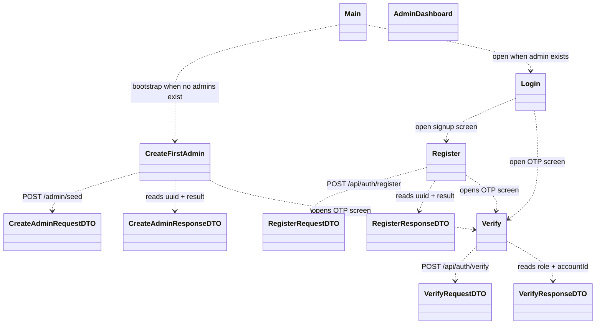
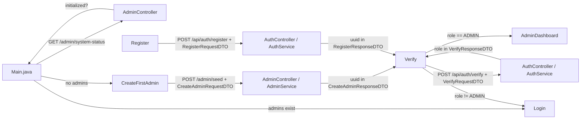

# Campus Events: run guide and DTO flow

This note covers how to start the application, how the first-admin bootstrap works, and how DTOs move from the Swing frontend into the Spring backend.

## Run It

### 1. Start the backend

From `backend/` run:

```powershell
.\mvnw.cmd spring-boot:run
```

Useful checks:

```powershell
.\mvnw.cmd -q -DskipTests compile
.\mvnw.cmd test
```

The backend exposes the admin status endpoint used by the frontend bootstrap screen:

- `GET /admin/system-status`

See [Main.java](../swing-frontend/swing-frontend/src/main/java/za/ac/cput/Main.java) and [AdminController.java](../backend/src/main/java/za/ac/cput/campus_events/controller/AdminController.java).

### 2. Start the Swing frontend

From `swing-frontend/swing-frontend/` run:

```powershell
.\mvnw.cmd exec:java
```

That launches [Main.java](../swing-frontend/swing-frontend/src/main/java/za/ac/cput/Main.java), which decides whether to open the bootstrap admin screen or the normal login screen.

## Bootstrap Flow

1. `Main.java` calls `GET /admin/system-status`.
2. If the backend reports no admins, the app opens `CreateFirstAdmin`.
3. `CreateFirstAdmin` sends `CreateAdminRequestDTO` to `POST /admin/seed`.
4. The backend creates a pending admin registration, generates an OTP, emails it, and returns `CreateAdminResponseDTO` with the pending registration UUID.
5. `CreateFirstAdmin` opens `Verify` with that UUID.
6. `Verify` posts `VerifyRequestDTO` to `POST /api/auth/verify`.
7. On success, the backend returns `VerifyResponseDTO` with the verified role.
8. `Verify` opens `AdminDashboard` only when the verified role is `ADMIN`; otherwise it returns to `Login`.

## Registration Flow

1. `Register` loads faculties from `GET /faculty` and fills the faculty dropdowns.
2. The user submits `RegisterRequestDTO` to `POST /api/auth/register`.
3. The backend stores a pending registration and returns `RegisterResponseDTO` with a UUID.
4. `Register` opens `Verify` with that UUID.
5. `Verify` completes the OTP step through `POST /api/auth/verify`.

The frontend DTOs are separate copies from the backend DTOs, but they carry the same JSON fields so Jackson can map them cleanly in both directions.

## UML Diagram



## DTO Data Flow Diagram



## What the DTOs carry

- `CreateAdminRequestDTO`: first name, last name, email, password
- `CreateAdminResponseDTO`: success, message, adminId, uuid
- `RegisterRequestDTO`: role, first name, last name, email, password, facultyId, studentNumber
- `RegisterResponseDTO`: success, message, uuid, email, pin
- `VerifyRequestDTO`: uuid, pin
- `VerifyResponseDTO`: success, message, accountId, role

## Notes

- The first-admin flow is a one-time bootstrap path.
- The admin dashboard should only open after a successful verification where the backend says the verified role is `ADMIN`.
- The faculty dropdown is populated from the backend, not hard-coded.
